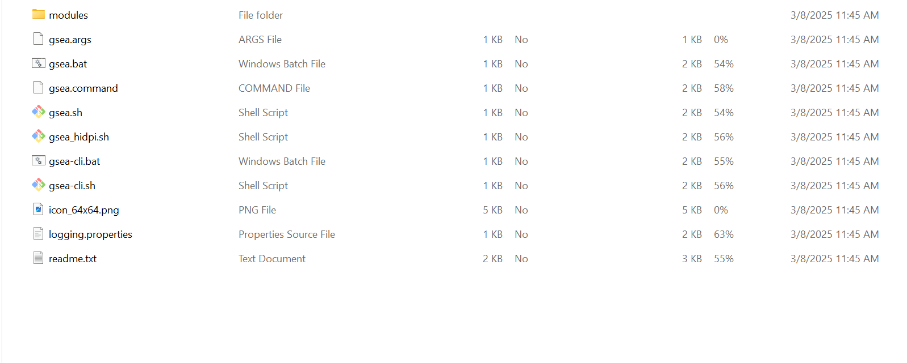

# India_Nasal_Cells
This repository contains data and code used in the analysis of the RNA sequencing nasal Indian data

Initial notes:

If there are any questions regarding how the data was processed to generate the gene counts table, please refer to the `Raw_Data_Processing` `README.md` file.

R packages you will need to run this portion:
- limma
- ggplot2
- DESeq2
- edgeR
- tidyverse

------

# Code (In Order)

# 1. **Limma Analysis** 
Purpose: To run a statistical analysis and find differentially expressed genes (DEGs) as potential indicators for TB.

- Ensure that you are running a POSIX compliant shell (e.g. bash, zsh, etc.) and have R installed on your system. Specifically, Rscript should be on PATH.
- Install the following R packages:
    - CRAN: ggplot2
    - Bioconductor: DESeq2, limma, edgeR

  If you need to install them, simply uncomment these
  lines in deg_analyses.R and run the script. You can comment them out again after you have the packages installed to save time in future runs.:

  ```r
  options("repos" = c(CRAN = "http://cran.r-project.org"))
  if (!requireNamespace("BiocManager", quietly = TRUE)) {
      install.packages("BiocManager")
  }

  install.packages("ggplot2")
  BiocManager::install(c("DESeq2", "limma", "edgeR"))
  ```

- In the root project directory, create (if it doesn't exist), a folder named
"data". In this folder, there should be a copy of the following files: 
    - gene_counts.tsv (This is the file generated from the STAR alignment and feature counts steps)
    - genetype_lookup.txt (This is the file that we generated from the genome annotatios gtf file. We'll use this to filter out non-protein coding genes from our analysis and map gene ids to gene names)
    - metadata.tsv (This contains the metadata, including the sample names, disease status, and age of the patients. This is used in the limma analysis when we control for sex later).
- cd into the deg folder with:

```bash
cd deg
```

- Run the following code in your shell to perform the Differential Gene Expression analysis:

```bash
Rscript deg_analyses.R
```

- Note: we have commented out all the code for the analyses that we didn't use in our results in the interest of saving you time (It will take another 10-15 minutes if you choose to uncomment the other tests). If you want to run the other analyses too, simply uncomment the code for those analyses found at the very end of the script and run the script again.
- If it succeeded, in the data directory, there should be a lpm_protein_control_nothing/ and an lpm_protein_control_sex/ directory.
- In those, you'll see the pvalue histogram and volcano plot (used in our paper). Additionally, you'll see the full results table order by FDR corrected pvalue. We will use the t statistic from the control sex results table as our ranking metric for the GSEA pathway analysis later on.
- In the lpm_protein_control_nothing/ results significant File, you will find our two primary DEGs, which we used in the subsequent machine learning step.

# 2. **TBSignatureProfiler**
- TBSignature Profiler is a bioconductor package that evaluates a variety of previously published Tuberculosis signatures on our dataset
    - Documentation can be found here: https://wejlab.github.io/TBSignatureProfiler-docs/
- While working in the `TBSignatureProfiler` directory, run the `india_nasal_TBsignatureProfiler.R` file with the command:

```bash
Rscript india_nasal_TBsignatureProfiler.R
```

- There is a set of install commands at the top of the R file that are not necessary if the following dependencies are fulfilled: `tidyverse`, `ggplot2`, `readr`, `cowplot`,`HGNChelper`, `pROC`, `TBSignatureProfiler`, `sva`, `SummarizedExperiment`

# 3. **ROC Pipeline**
- Install R  and (optional R studio) https://posit.co/download/rstudio-desktop/
- Open repository in Rstudio and **set working directory to folder "India_Nasal_Cells"** (go to the file tab in Rstudio click the gear icon and select "set as working directory") or when running R files in R script (command line) run from folder "India_Nasal_Cells"
    - All results will be saved as PDFs in the models folder
- Run roc_models_figure2.R
- Run roc_models_figure3.R
- for external validation go to https://github.com/nisreenkhambati/uganda_nasal_cells/tree/main/data copy "nasalcoldata.csv" & "nasalcounts.csv" then paste into our /data folder
    - Run roc_models_figure4.R

# 4. **GSEA Pathway Analysis**
- Ensure that you are running a POSIX compliant shell (e.g. bash, zsh, etc.). The wget utility should be installed on your system and be on PATH. We will be using it to download the gene sets from the MSigDB database. You can check if you have wget installed by running:

```bash
wget --version
```

If you don't have wget installed, you can install it using your system's package manager.

For windows, if your using chocolatey (if not then get it).

```bash
choco install wget
```

For MacOS in your using homebrew (if not then get it).

```bash
brew install wget
``` 

- Ensure that Java in installed on your system and that the version is 21 or later. You can check your Java version by running:

```bash
java -version
```

**VERY IMPORTANT**: The pathway analysis will NOT work if you are using a version of Java that is older than 21. If you have an older version of Java, you will need to uninstall it and install Java 21 or later. The GSEA software requires Java 21 or later to run, and using an older version will result in errors when you try to run the pathway analysis.

If you don't have Java installed, you can download it from the official Oracle website: https://www.oracle.com/java/technologies/downloads/. Make sure to download Java SE Development Kit (JDK) version 21 or later. Make sure that its on path after installation. You can run the java -version command again after installation to confirm that it is correctly installed and on PATH.

**NOTE**: after adjusting PATH or installing new software, it is often necessary to restart your terminal for the changes to take effect. If you find that after installing Java or wget, you are still getting errors that they are not found, try closing and reopening your terminal and running the commands again.

- Ensure that you have the GSEA software (invoked via the CLI) on your system. you can download it from the Msigdb website here: https://www.gsea-msigdb.org/gsea/downloads.jsp. It may prompt you to input your email. Choose the CORRECT version:
DO NOT CHOOSE THE ONE SPECIFIC TO A PLATFORM. CHOOSE THIS ONE:
    - **GSEA v4.4.0 for the command line (all platforms)**
- Unzip the GSEA distibution. It should look something like this.

- In the unzipped GSEA distribution, there should be a file called "gsea-cli.sh". This file is VERY IMPORTANT. save the ABSOLUTE PATH to this file. We will use it to invoke the GSEA software from the command line.

- In the pathways/gsea_analysis_ranked.sh, there is a variable at the top called GSEA_EXEC_PATH. **Set this variable to the absolute path** of the gsea-cli.sh file that we just talked about. It should look something like this:

```bash
# -----------------------------
# GSEA PRERANKED RUN CONFIGURATION
# Edit these values before each run.
# -----------------------------

GSEA_EXEC_PATH="/path/to/gsea-cli.sh" # EDIT THIS. put your absolute path to the gsea-cli.sh file here.
RANKED_FILE="" # DONT edit this
GENESET_FILE="" # DONT edit this
OUT_DIR="" # DONT edit this
```

- Ensure that python is installed an on PATH. Ensure that the following python packages are installed:
    - pandas
    - matplotlib
    - numpy

You can install these packages using pip if you don't have them already:

```bash
pip install pandas matplotlib numpy
```

- Now we can run the analysis.
- Ensure that you are in the root directory of the project in your terminal. You should see folders like DATA, deg, R, etc. when you run `ls` or `dir` in the terminal.
- Then, cd into the pathways directory with:

```bash
cd pathways
```

- Run the following command to generate the .rnk file needed for the GSEA analysis.

```bash
python create_rnk.py
```

NOTE: You must ensure that these shell scripts have execute permissions for your own user (ie file owner) on your machine. This can be done with the following command:

```bash
chmod u+x <shell_script_name>.sh
```

- Run the following command to download the gene set files from msigdb.

```bash
./download_gene_sets.sh
```

- There should now be a folder data/pathways/msigdb containing all the gene set files that we will use in our analysis.

- run the following command to run the GSEA analysis:
    - Note, this should take like 10 minutes if your computer is slow like mine

```bash
./run_ranked_analyses.sh
```

- Generate the pathway analysis figure with the following command:

```bash
python create_gsea_figure.py
```

- There should now be a figure called gsea_publication_figure.png in the data/pathways directory. This is the figure that we used in our paper.
