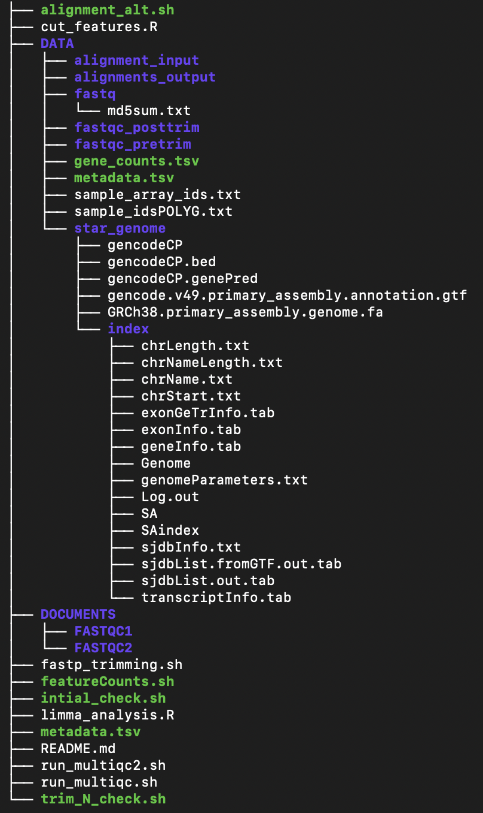
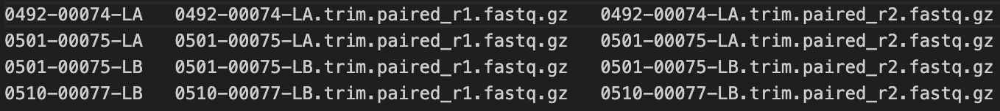
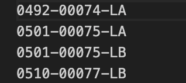

# India_Nasal_Cells FastQ Processing Supplementary Info

## Initial notes:

This code is not meant to be run as the original data is not in the repository. The folder organization required to run this code is shown below in the directory tree below. The purpose of this information is provided to answer any questions about initial data processing prior to the generation of the gene counts table.


This code primarily utilizes bash, Python, R, and slurm scripts to run the pipeline. Ensure that you have a python, R IDE to utilize the code and generate figures.

Slurm scripts can be run using `sbatch [NAME_OF_SCRIPT]` in the terminal. When to use slurm will be indicated in the directions below.

Most slurm parameters (indicated at the top as `#SBATCH`) is optimized for the task. Ensure that the pathways for

`#SBATCH --output=`
`#SBATCH --error=`

are correct for your setup.

All input and output directories, except for your initial `INPUT_DIR` has already been created in the `DATA` folder. Packages were installed using Conda (installation information found here: https://docs.conda.io/projects/conda/en/latest/user-guide/install/index.html) and the Bioconductor installer (using this command `conda install bioconda::PACKAGE_NAME'). Conda packages not found in Bioconductor were installed using 'conda install PACKAGE_NAME' command in the terminal.

-----

`CONDA_ENV` can be found by using the following command:

```bash
conda info --base | awk '{print $1 "/etc/profile.d/conda.sh"}'
```
other common locations:
- Miniconda (Default): ~/miniconda3/etc/profile.d/conda.sh
- Anaconda (Default): ~/anaconda3/etc/profile.d/conda.sh
- macOS Homebrew: /usr/local/Caskroom/miniconda/base/etc/profile.d/conda.sh
- Linux (System-wide): /opt/anaconda3/etc/profile.d/conda.sh

Please note to activate the Conda environment you install the package(s) in at the conda initialization steps (shown as 'conda activate [NAME OF ENVIRONMENT]') in each file.

------

Conda Packages you will need to run this portion:
- fastqc
- multiqc
- fastp
- STAR
- samtools
- subread

R packages you will need to run this portion:
- limma
- ggplot2
- DESeq2
- edgeR
- tidyverse

------


# Code (In Order)



## 1. **Pre-Trim Quality Control** (Slurm)

Purpose: To initial check the quality of the RNAseq data to see if trimming is necessary. If data is clean, adapter content needs to be removed and most indicators on the multiqc report should be green on the left hand side of the report.

Package(s) needed:
- fastqc
- multiqc

Variable(s) to adjust:
- CONDA_ENV *pathway to your conda environment source folder*
- HOME_DIR *pathway to the base home directory* 
- INPUT_DIR *insert pathway to fastq files; found in DATA folder in git*

Other Variable(s):
- OUTPUT_DIR *destination fastqc folder*
- SAMPLE_LIST *the file with the array of sample IDs in the DATA folder*

`SAMPLE_LIST` should look something like this:  
  




Script to run:
- `initial_check.sh`
- `run_multiqc.sh` (no slurm needed)

## 2. **Trimming and Post-Trim Quality Control** (Slurm)

Purpose: To trim and improve the quality of our reads, then running another check to see if the data passes most indicators in the multiqc report.

Package(s) needed:
- fastp
- fastqc
- multiqc

Variable(s) to adjust:
- CONDA_ENV *pathway to your conda environment source folder*
- HOME_DIR *pathway to the base home directory*

Other Variable(s):
- INPUT_DIR *pathway to fastq files; found in DATA folder in git*
- OUTPUT_DIR *destination folder for trimmed fastq files*
- OUTPUT_DIR2 *destination folder for fastqc folders*
- SAMPLE_LIST *the file with the array of sample IDs in the DATA folder*

Script to run:
- `trim_N_check.sh`
- `run_multiqc2.sh` (no slurm needed)

## 3. **STAR Alignment** (Slurm)

Purpose: Aligning RNAseq reads to the human genome to find which genes are associated with which sequences of RNA. We then convert the output (SAM files) to BAM files in preparation to get a gene count table.

Package(s) needed:
- STAR
- samtools

Variable(s) to adjust:
- CONDA_ENV *pathway to your conda environment source folder*
- DATA_DIR *input directory of trimmed fastq files*
- OUTPUT_DIR *finalized bam files output from STAR aligner and samtools conversion*

Other Variable(s):
- genome_index_dir *genome index files, provided in DATA folder*
- annotations_gtf *annotations files found in DATA folder*
- temp_dir *temporary directory for files in case something gets corrupted, is removed at the end of project*
- SAMPLE_LIST *alternative sample list found in the DATA folder*

`SAMPLE_LIST` is a sample list with a different format from your last steps and should just be the sample names:  
  
  

Script to run:
- `alignment_alt.sh`

## 4. **Generate Feature Counts Table**

Purpose: Counting all of the gene using the featureCounts package and generating a gene counts table to use in our analysis.

Package(s) needed:
- subread

Variable(s) to adjust:
- CONDA_ENV *pathway to your conda environment source folder*
- GTF *annotation folder provided in DATA folder*

Other Variable(s):
- INPUT_DIR *input directory of BAM files from alignment_alt.sh output*
- OUTPUT_DIR *output directory for the feature counts table needed for DEG analysis*
- LOG_DIR *directory for error log files*

Script to run:
- `featureCounts.sh`


## 5. **Conclusion**
After running all of these steps, you should generate the gene counts table found in the `data` folder in the git repository.